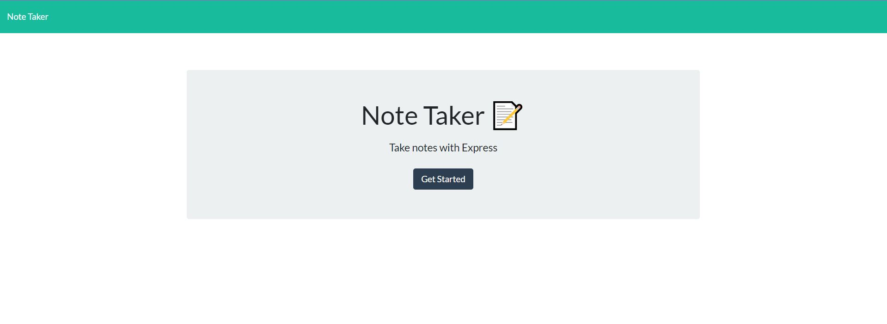
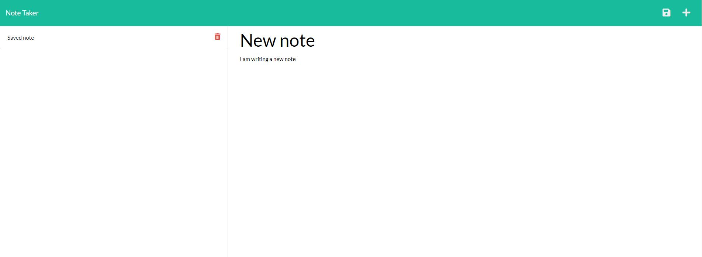

# Note Taker App

## Description

An application, using Express.js routing, to deliver a web page to write, save and delete notes. This application has been deployed to Heroku.

## LANGUAGE : JavaScript, HTML, CSS

## TOOLS : Node.js, Express.js

## DEPLOYED APPLICATION

https://secure-lowlands-58892.herokuapp.com/

## FILES

- db > db.json file to record saved notes
- img > folder with 2 README screenshots
- public > folder containing the provided pre-written starter code; CSS, Javascript and HTML pages
- .gitignore - file to record local files that should not be uploaded to repository e.g. node_modules
- package-lock.json - node modules tree visiblity
- package.json - node.js metadata
- README.md - project information
- server.js - file with Express.js routes for pages, server port set-up, and functions to create and delete notes

## Table of Contents

- [Installation](#installation)
- [Usage](#usage)
- [Contributing](#contributing)
- [Tests](#tests)
- [Questions](#questions)

## Installation

If you still want to install on your own computer;

1. Clone the Github repository
2. Open a terminal and run 'npm start' to start your local server
3. Follow the 'localhost:3001' link in the terminal to navigate to the deployed page and start taking notes!

## Usage

This application requires each note to have a title and description before it can be saved.
Once this criteria is met, a 'save' icon will appear in the top right corner to save your note.
Once saved, notes are moved to the left column and can be viewed again, or deleted using the red trashcan icon.

## Contributing

Read the installation notes. Any contributions or improvements very welcome, but please do not push changes directly to the main branch - please create your own branch and push changes for review.

## Questions

If you have any questions about this project, please contact me directly at viennabdev@gmail.com. You can view more of my projects at https://github.com/ViennaBorowska.
